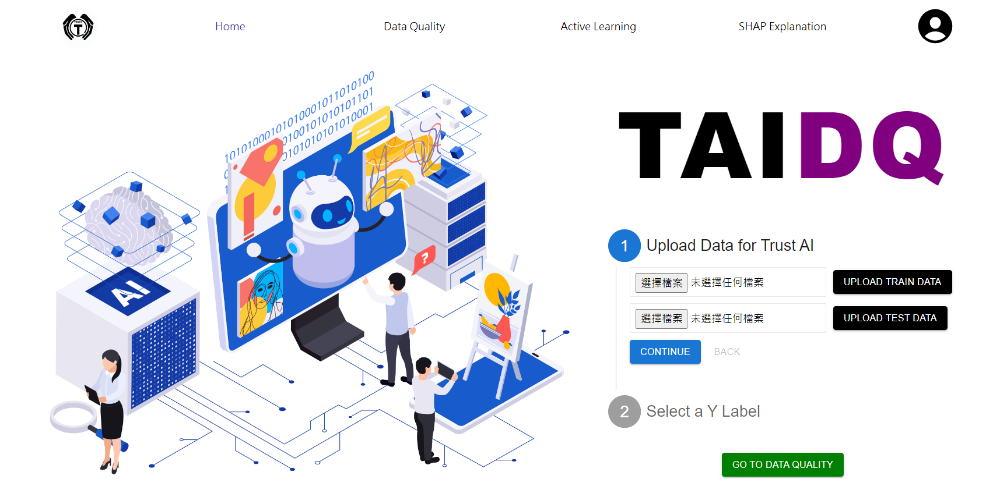

# TAI DQ website

> frontend: React, Tailwind

> backend: Django Postgres

Integrated backend with Docker for containerization.

## Project Overview
This project focuses on two major areas: data quality (DQ) and explainable AI (XAI). It aims to establish automated processes to reduce data processing costs and improve reliability.

#### Data Quality(DQ)
In the realm of data quality, we improve data availability through matrix and matrix-free complementation methods. We evaluate the results using indicators such as Differential Entropy, Canonical Relative Entropy, and correlation. For more detailed information about DQ, please refer to the link below:
#### DQ repo: [EDASH](https://github.com/forbes110/EDASH)

#### Trust AI (TAI)
Our Trust AI system interacts with users through Active Learning, adapting to various customized data and needs. It incorporates Knowledge Distillation to ensure the stability of the active learning process and reduce the final number of parameters. The system then evaluates the model's explainability and counterfactuals using SHAP Explanations, helping users make informed decisions based on model results. By combining these modules, we aim to establish a comprehensive data processing pipeline that ensures model reliability and interpretability, ultimately improving overall performance.

#### Know More: [Presentation PPT](./專題簡報.pdf) | [Poster](./image/Poster.png)


## Demo 
#### Demo Video
https://drive.google.com/file/d/155tX3hSLL8DmC_Ts90cfWRs3gXJXQyK7/view

#### Website Preview



## To start the website

### Frontend:

<i>the website runs on</i> http://localhost:5173/

```
cd frontend
npm install
npm run dev
```

### Backend&DB:

- open your docker desktop (download from https://www.docker.com/products/docker-desktop/)
- need to add the tag --build to build an image for the first time

```
cd backend
docker compose up --build
```

<!-- # TrustAi

TrustAi website

> frontend: React, Tailwind

> backend: Python Django

## To start the Website

### Virtual Environment
Stay in the directory, create `.venv` folder

```
python3 -m venv .venv
```

Activate `.venv`

```
. .venv/bin/activate
```

Check activated Python

```
which python3
```

Upgrade `pip`

```
pip install --upgrade pip
```

Install packages

```
pip install -r requirements.txt
```

---

### Frontend
Go to frontend and install packages

```
cd frontend
yarn install
```
or `npm install` (whatever works)

Start the frontend...

```
yarn run dev
```

the website runs on http://localhost:5173/

---

### Backend
Open another terminal and go to backend

```
cd backend
```

#### Set up PostgreSQL
Note: MacOS instructions only

##### Names for user, password, db, etc.
- Host: `127.0.0.1` or `localhost`
- Port: `5432`
- User: `ntuimproject`
- Password: `ntuim`
- Database Name: `ntuimprojectdatabase`

Install PostgreSQL and start it
```
brew tap homebrew/services
brew install postgresql
brew services start postgresql
```

Enter Postgresql

```
psql postgres
```

then the terminal will be like:

```
postgres=# blablabla
```

Create New User

- ‘;’ cannot be omitted!
- note the `postgres=#` is the start of the line, no need to type it

```
postgres=# CREATE ROLE username WITH LOGIN PASSWORD 'quoted password';
```

enter `\du` to check if user is created

Add `CREATEDB` Permission to the Users to Allow Them to Create Databases:

```
ALTER ROLE username CREATEDB;
```
then quit by `\q`

Re-enter Postgresql with User Identity

```
psql postgres -U username
```

then the terminal will be like:

```
postgres=> blablabla
```

Under the Identification of this User, Create a Database

```
postgres=> CREATE DATABASE database_name;
```

check database and its user by `\l`

#### Download PgAdmin4
link: https://www.pgadmin.org/download/

and refer to this page for creating a database
https://www.codementor.io/@engineerapart/getting-started-with-postgresql-on-mac-osx-are8jcopb


Finally, run the Django server

```
python3 manage.py runserver
```

and the server would run on port http://127.0.0.1:8000

<i>The CORS policy is dealt by using vite proxy</i> -->
